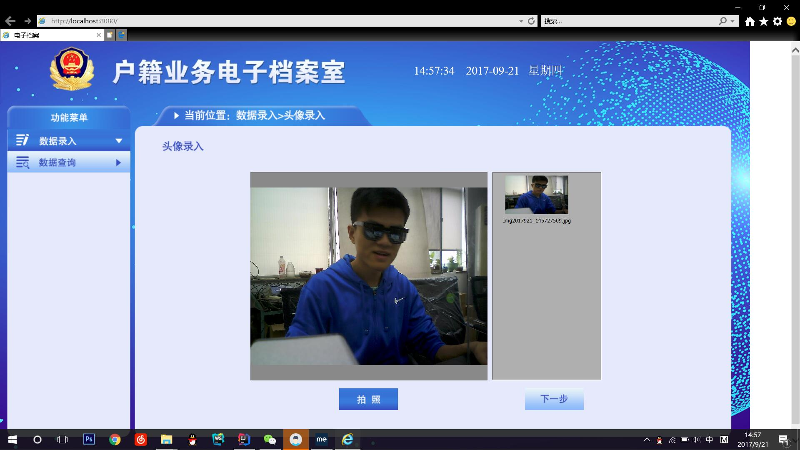

# Web based Image Acquisition and Data Management System

## The homepage of the web application is displayed below. 
Its main purpose is to collect high resolution photo and sacn ID for the local ID administration.

## Overview

This project focuses on integrating a high resolution cemera with the web ID/photo application on a tomcat server. By connecting with the global oracle database, a ID management system can be formed. 

## Structure

Built the web application on Tomcat Server with the help of Maven framework, Spring, Spring-MVC and MyBatis to manage data using Oracle database.

## Acknowledge
This is a group project for a ID administration system prototype.

